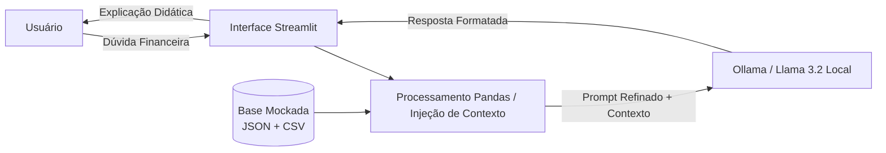

# 🦁 Léo — Educador Financeiro com IA Generativa Local

[](https://www.python.org/)
[](https://streamlit.io/)
[](https://ollama.ai/)
[]()

> Assistente financeiro consultivo e didático construído com IA Generativa 100% local (Llama 3.2 via Ollama), projetado para descomplicar as finanças pessoais com privacidade total de dados e rigor técnico em regras de negócio.

---

## 🎥 Pitch e Demonstração Prática

Confira a apresentação em vídeo (02:59) demonstrando a dor de mercado, a arquitetura local sem custos de APIs e o agente funcionando ao vivo:

👉 **[Assistir à Apresentação e Demonstração no YouTube](https://youtu.be/CQXC7zcPdBo)**

---

## 💡 Sobre o Projeto

Muitas pessoas sentem dificuldade em entender termos do mercado financeiro e organizar suas contas do mês por conta de nomenclaturas complexas ou assistentes bancários robóticos e engessados. Ao mesmo tempo, o receio em compartilhar dados bancários com servidores de terceiros na nuvem é uma barreira real de segurança.

O **Léo** foi desenvolvido para preencher essa lacuna como um mentor acessível:
- **Didático e Humano:** Explica conceitos em linguagem acolhedora, sem complicar ou julgar o cliente.
- **Baseado em Contexto Real:** Analisa despesas, perfil de investidor e metas do cliente para gerar explicações personalizadas.
- **Compliance e Sem Recomendação:** Segue regras estritas de segurança para atuar exclusivamente como educador, nunca recomendando compras imperativas de ativos.
- **Privacidade Absoluta (Edge AI):** Roda localmente no computador do usuário, eliminando custos de APIs externas e blindando os dados contra vazamentos na nuvem.

---

## 🛠️ Tecnologias Utilizadas

- **LLM Local:** Meta Llama 3.2 (3B) executado via [Ollama](https://ollama.ai/)
- **Interface Web:** [Streamlit](https://streamlit.io/)
- **Engenharia de Dados:** Python e [Pandas](https://pandas.pydata.org/) para agregação e cálculo determinístico de despesas
- **Engenharia de Prompt:** Few-Shot Prompting, System Prompts com Guardrails anti-alucinação e injeção dinâmica de contexto

---

## 🏗️ Arquitetura da Solução



---

## 📂 Estrutura do Repositório

```text
├── data/                             # Base de conhecimento mockada
│   ├── historico_atendimento.csv     # Atendimentos anteriores do cliente
│   ├── perfil_investidor.json        # Perfil e metas do cliente (João Silva)
│   ├── produtos_financeiros.json     # Catálogo de produtos (Selic, CDB, FII, Ações)
│   └── transacoes.csv                # Extrato de receitas e despesas
├── docs/                             # Documentação técnica detalhada
│   ├── 01-documentacao-agente.md     # Persona, tom de voz e requisitos
│   ├── 02-base-conhecimento.md       # Estrutura e estratégia de injeção dos dados
│   ├── 03-prompts.md                 # Engenharia de prompts e edge cases
│   ├── 04-metricas.md                # Avaliação de qualidade e assertividade
│   └── 05-pitch.md                   # Roteiro cronometrado e link do pitch
├── src/                              # Aplicação
│   ├── app.py                        # Chatbot em Streamlit integrado ao Ollama
│   └── README.md                     # Passo a passo de execução técnica
└── README.md                         # Visão geral do projeto
```

---

## 🚀 Como Executar Localmente

### 1. Pré-requisitos
- Python 3.10 ou superior instalado
- [Ollama](https://ollama.ai/) instalado

### 2. Configurar o Modelo no Ollama
No terminal, baixe o modelo Llama 3.2 (3B) e inicie o serviço:
```bash
ollama pull llama3.2:3b
ollama serve
```

### 3. Instalar as Dependências
Clone o repositório e instale as bibliotecas necessárias:
```bash
git clone [https://github.com/diegofloriano/dio-lab-bia-do-futuro.git](https://github.com/diegofloriano/dio-lab-bia-do-futuro.git)
cd dio-lab-bia-do-futuro
pip install streamlit pandas requests
```

### 4. Executar o Chatbot
```bash
python -m streamlit run src/app.py
```
Acesse a aplicação no navegador em `http://localhost:8501`.

---

## 🧪 Casos de Teste Validados na Demonstração

1. **Diagnóstico Orçamentário:** Identifica que Moradia (R$ 1.380,00) e Alimentação (R$ 570,00) concentram quase 80% do orçamento, conectando os dados com a meta da reserva de emergência.
2. **Orientação sem Recomendação:** Diante da dúvida sobre investir a reserva em ações, explica didaticamente a volatilidade do ativo e foca na necessidade de segurança e liquidez, sem dar ordens de compra ou venda.
3. **Trava de Segurança (Edge Case):** Diante de perguntas fora do escopo financeiro (*"Qual a previsão do tempo para amanhã?"*), recusa o desvio com educação e redireciona o foco para o planejamento financeiro.

---

## 👤 Autor

Desenvolvido por **Diego Floriano Costa**  
- **GitHub:** [@diegofloriano](https://github.com/diegofloriano) 
- **LinkedIn:** [Diego Floriano](https://www.linkedin.com/in/diego-floriano)
